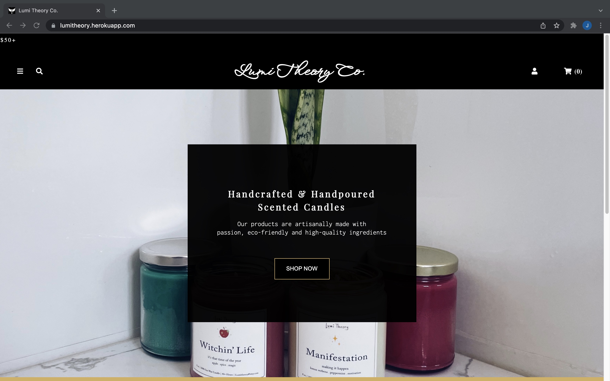
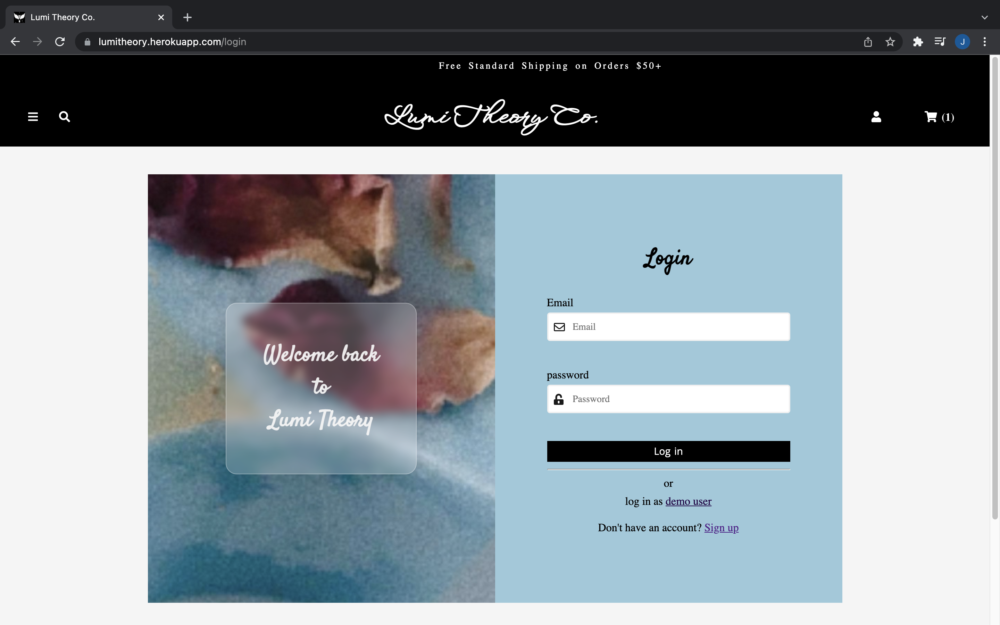
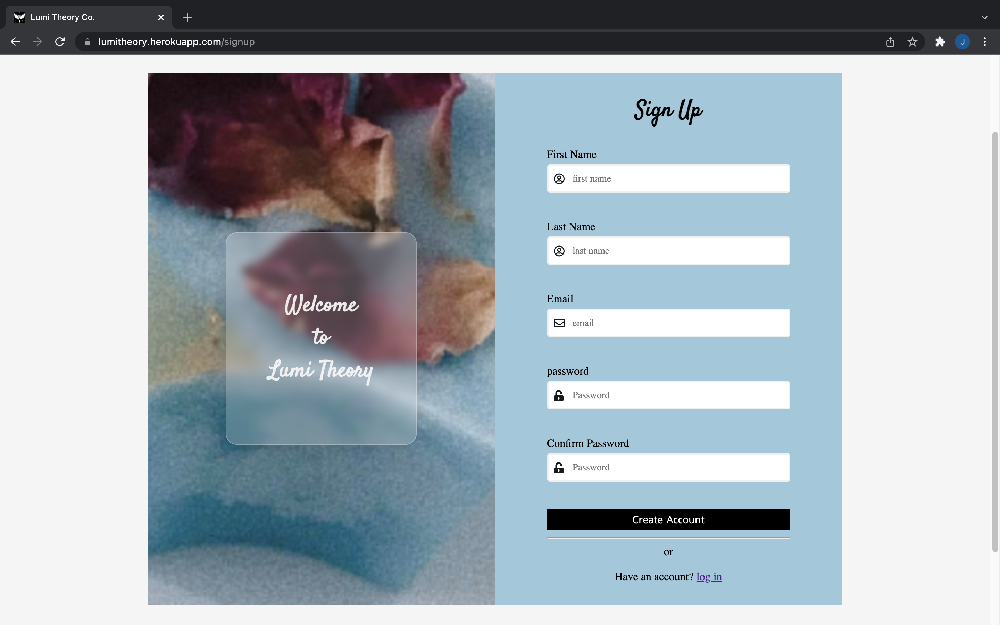
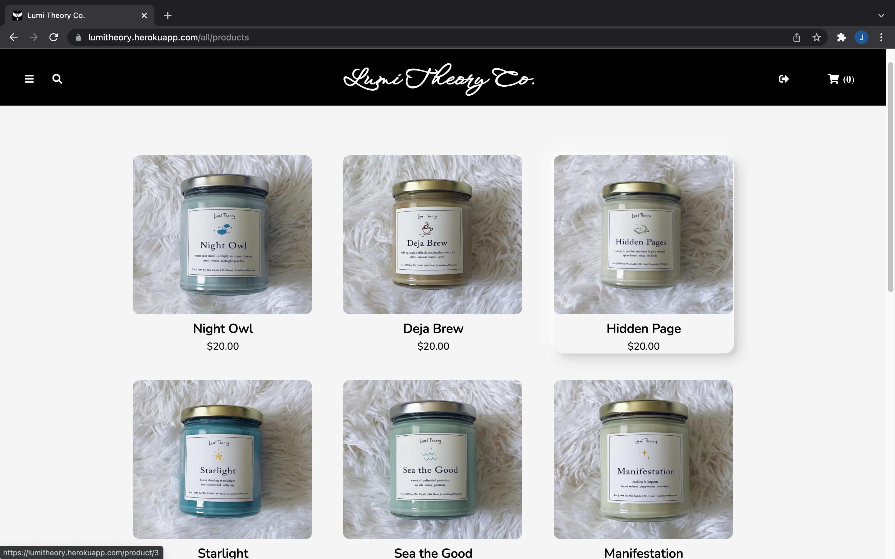
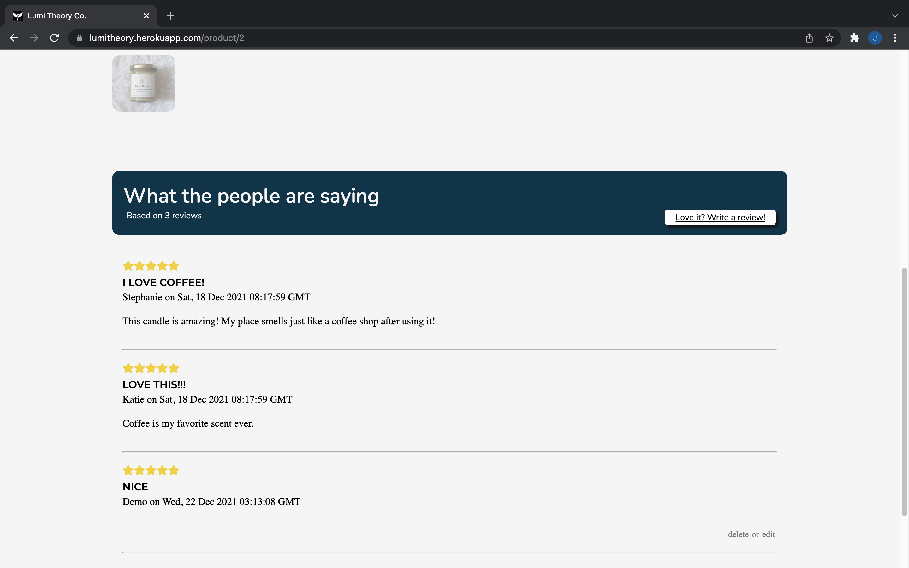
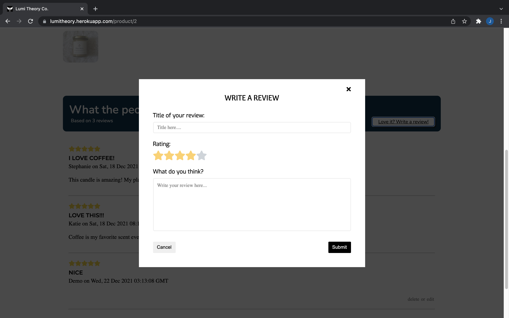

# Lumi Theory Co. 

Lumi Theory Co. is an e-commerce application for my handcrafted, eco-friendly candles. This full stack app is inspired by my passion for making things happen. This app will be continuously be developing. Check out what I have built so far! 

* live demo: [Lumi Theory Co.](https://lumitheory.herokuapp.com/)

## Technologies 
* Here are the main technologies used to built this application.
    *  Backend: Python, Flask, WTForms, SQLAlchemy, PostgreSQL 
    * Frontend: Javascript, React/Redux, CSS3

## Site Walkthrough

* This is the splash page. You can choose to sign-up for new user, login for current user, or be a demo user.     


* User can log in or log in as demo via the login page.   


* User can sign up for an account via the sign up page.  


* User can view all the products on this page.


* User can view a selected product details on the product's individual page.


* User can see the review of each product.


* Logged in user can leave a review.


* User can add items to cart and make purchase


## Upcoming Implementation & Functionality 
* Search bar
* User's dashboard


# Flask React Project

This is the starter for the Flask React project.

## Getting started

1. Clone this repository (only this branch)

   ```bash
   git clone https://github.com/appacademy-starters/python-project-starter.git
   ```

2. Install dependencies

      ```bash
      pipenv install --dev -r dev-requirements.txt && pipenv install -r requirements.txt
      ```

3. Create a **.env** file based on the example with proper settings for your
   development environment
4. Setup your PostgreSQL user, password and database and make sure it matches your **.env** file

5. Get into your pipenv, migrate your database, seed your database, and run your flask app

   ```bash
   pipenv shell
   ```

   ```bash
   flask db upgrade
   ```

   ```bash
   flask seed all
   ```

   ```bash
   flask run
   ```

6. To run the React App in development, checkout the [README](./react-app/README.md) inside the `react-app` directory.

***
*IMPORTANT!*
   If you add any python dependencies to your pipfiles, you'll need to regenerate your requirements.txt before deployment.
   You can do this by running:

   ```bash
   pipenv lock -r > requirements.txt
   ```

*ALSO IMPORTANT!*
   psycopg2-binary MUST remain a dev dependency because you can't install it on apline-linux.
   There is a layer in the Dockerfile that will install psycopg2 (not binary) for us.
***

## Deploy to Heroku

1. Before you deploy, don't forget to run the following command in order to
ensure that your production environment has all of your up-to-date
dependencies. You only have to run this command when you have installed new
Python packages since your last deployment, but if you aren't sure, it won't
hurt to run it again.

   ```bash
   pipenv lock -r > requirements.txt
   ```

2. Create a new project on Heroku
3. Under Resources click "Find more add-ons" and add the add on called "Heroku Postgres"
4. Install the [Heroku CLI](https://devcenter.heroku.com/articles/heroku-command-line)
5. Run

   ```bash
   heroku login
   ```

6. Login to the heroku container registry

   ```bash
   heroku container:login
   ```

7. Update the `REACT_APP_BASE_URL` variable in the Dockerfile.
   This should be the full URL of your Heroku app: i.e. "https://flask-react-aa.herokuapp.com"
8. Push your docker container to heroku from the root directory of your project.
   (If you are using an M1 mac, follow [these steps below](#for-m1-mac-users) instead, then continue on to step 9.)
   This will build the Dockerfile and push the image to your heroku container registry.

   ```bash
   heroku container:push web -a {NAME_OF_HEROKU_APP}
   ```

9. Release your docker container to heroku

      ```bash
      heroku container:release web -a {NAME_OF_HEROKU_APP}
      ```

10. set up your database

      ```bash
      heroku run -a {NAME_OF_HEROKU_APP} flask db upgrade
      heroku run -a {NAME_OF_HEROKU_APP} flask seed all
      ```

11. Under Settings find "Config Vars" and add any additional/secret .env
variables.

12. profit

### For M1 Mac users

(Replaces **Step 8**)

1. Build image with linux platform for heroku servers. Replace
{NAME_OF_HEROKU_APP} with your own tag:

   ```bash=
   docker buildx build --platform linux/amd64 -t {NAME_OF_HEROKU_APP} .
   ```

2. Tag your app with the url for your apps registry. Make sure to use the name
of your Heroku app in the url and tag name:

   ```bash=2
   docker tag {NAME_OF_HEROKU_APP} registry.heroku.com/{NAME_OF_HEROKU_APP}/web
   ```

3. Use docker to push the image to the Heroku container registry:

   ```bash=3
   docker push registry.heroku.com/{NAME_OF_HEROKU_APP}/web
   ```

